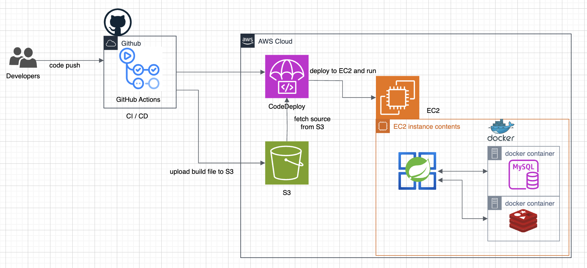
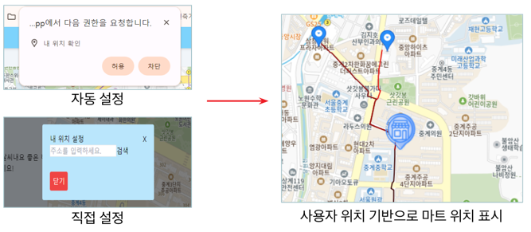
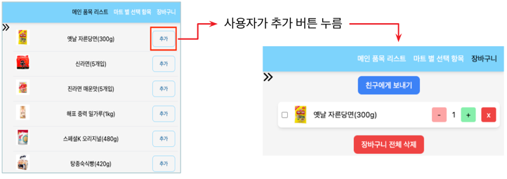
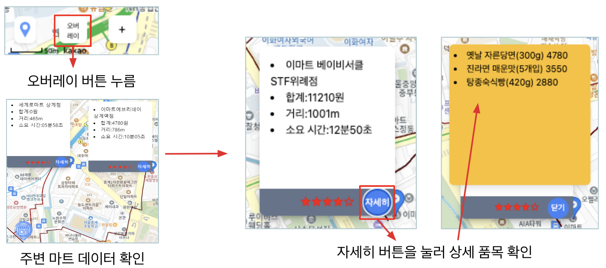
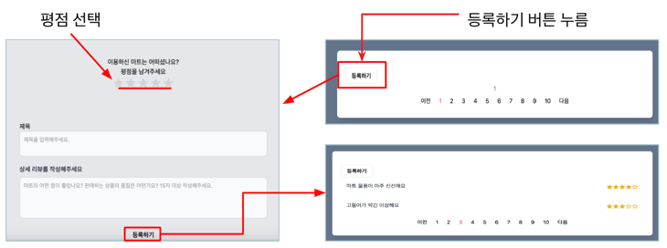

# SsaGeMeogJa(싸게먹자) Backend

## 프로젝트 개요
고물가 시대에 합리적인 소비를 돕기위한 프로젝트 
높은 배달비와 물가가 부담스러워 마트를 방문하는 소비자들에게 각 마트별 가격과 거리를 비교할 수 있는 정보를 제공합니다. 
사용자가 장바구니에 담은 상품을 기반으로 "주변 마트의 거리", "상품 가격 정보"를 제공하여 합리적인 소비를 할 수 있도록 돕습니다.

## 핵심기능
1. Auth2.0 로그인
2. 카카오 맵을 이용한 사용자 위치 및 주변 마트 위치, 거리 제공
3. 마트별 상세 데이터 및 상품 데이터 제공(공공데이터)
4. 장바구니서비스 및 장바구니에 담긴 상품의 가격을 마트별로 제공
5. 마트별 리뷰,평점 제공

## 기술스택
`Java`, `SpringMVC`, `Spring WebFlux`, `Spring Security`, `Spring Data JPA`, `MySQL`, `Redis`, `FlyWay`, `AWS EC2`, `AWS S3`, `AWS CodeDeploy`, `Github Actions`

## 팀원 및 역할
### 황동근
- 팀장
- 로그인/로그아웃 구현
- 카카오맵 활용 서비스 구현
### 원정문
- 마트 데이터 제공 서비스 구현
### 이준오
- 장바구니 관련 서비스 구현
- CI/CD 구축 및 인프라 관리
### 김정규
- 리뷰, 평점 관련 서비스 구현
- 카카오맵 활용 서비스 구현

## 협업방식 및 팀규칙
- Notion을 활용한 API 명세서 및 공동 문서 작업
- Discord 음성/채팅/화면공유 회의
- GitHub Issue, PullRequest 를 통한 작업 현황 공유 및 코드리뷰
- 깃 커밋 컨벤션: Udacity Style
- 깃 브랜치 전략: GitHub Flow

## 아키텍처

## 시연영상
https://youtu.be/9hbXQyZsNpk

## 핵심기능 구현 화면
### 사용자 기반 마트 표시

- 위치 정보 권한 허용시 현재 위치기반으로 주변 마트 표시
- 주소 직접설정 가능
- 현재위치와 마트위치 표시 및 길 표시 

### 장바구니 및 마트 상품 제공 서비스

- 마트 상품 데이터(list) 제공
- 장바구니 추가, 수정, 삭제 기능 제공

### 마트 상세 내역

- 마트 상세내역 제공
  - 마트까지의 거리, 소요시간
  - 장바구니에 저장된 상품 가격의 총합

### 리뷰 및 평점

- 리뷰 및 평점 조회, 등록, 수정, 삭제 기능 제공
- 마트별 평점 계산 및 제공 